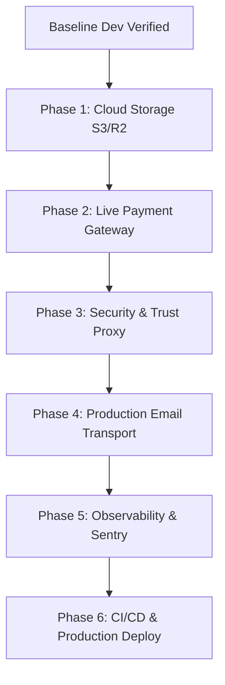

# 🚀 Simbolo Monorepo — Production Roadmap & Future Build Guide

This document serves as the master technical blueprint and implementation roadmap for transitioning the **Simbolo Digital Marketing Platform** from its fully verified local development state to a hardened, enterprise-grade production environment.

---

## 📌 Executive Summary & Baseline Status

Currently, the core architecture is **100% functional** across all services:
- **Landing App (`@simbolo/landing`)**: `http://localhost:3003` — Marketing, blog, services, pricing, audit lead forms (**8 / 8 pages verified**).
- **Client Portal (`@simbolo/client`)**: `http://localhost:3002` — Client dashboard, project management, billing, chat, documents (**15 / 15 pages verified**).
- **Admin CMS (`@simbolo/admin`)**: `http://localhost:3000` — CMS content management, user roles, catalog, analytics (**15 / 15 pages verified**).
- **Backend API (`@simbolo/backend`)**: `http://localhost:3001/api/v1` — NestJS REST API, Prisma ORM, JWT/RBAC auth (**22 / 22 endpoints verified**).

---

## 🛠️ Future Build Phases & Implementation Tasks



---

### Phase 1: Cloud Storage & Media Asset Management (High Priority)
- [ ] **AWS S3 / Cloudflare R2 SDK Integration**:
  - Update [storage.service.ts](file:///c:/Users/Asus/Desktop/simbolo/NEW/newSimbolo/backend/src/storage/storage.service.ts) to replace the fallback `LocalStorageProvider` with an `@aws-sdk/client-s3` provider when `STORAGE_PROVIDER=s3` or `STORAGE_PROVIDER=r2`.
  - Configure bucket permissions, CORS headers, and private asset signed URL generation for client deliverables and invoices.
- [ ] **CDN Image Optimizations**:
  - Attach Cloudflare R2 / AWS CloudFront CDN URL (`STORAGE_CDN_URL`) for public media assets (blog images, portfolio thumbnails, avatars).

---

### Phase 2: Live Payment Gateway & Webhooks (High Priority)
- [ ] **Razorpay Live Gateway Setup**:
  - Replace test key placeholders with production `RAZORPAY_KEY_ID` and `RAZORPAY_KEY_SECRET` in `backend/.env`.
  - Verify real currency processing (`INR`, `USD`) and order creation in [razorpay.provider.ts](file:///c:/Users/Asus/Desktop/simbolo/NEW/newSimbolo/backend/src/payments/razorpay.provider.ts).
- [ ] **Webhook Signature Verification & Idempotency**:
  - Configure `RAZORPAY_WEBHOOK_SECRET` in environment.
  - Test `/api/v1/webhooks/razorpay` endpoint for `payment.captured`, `subscription.charged`, and `payment.failed` event processing.

---

### Phase 3: Production Security, CORS & Rate Limiting (High Priority)
- [ ] **NestJS Trust Proxy Setup**:
  - Add `app.set('trust proxy', 1)` in NestJS [main.ts](file:///c:/Users/Asus/Desktop/simbolo/NEW/newSimbolo/backend/src/main.ts) so `@nestjs/throttler` tracks real client IPs behind Nginx / Cloudflare reverse proxies instead of proxy IPs.
- [ ] **Strict Production CORS Policy**:
  - Update `FRONTEND_URLS` in `backend/.env` with production HTTPS origins (`https://yourdomain.com`, `https://app.yourdomain.com`, `https://admin.yourdomain.com`).
- [ ] **OAuth2 Social Credentials**:
  - Configure production Google OAuth Client ID & Client Secret for `/api/v1/auth/google/callback`.

---

### Phase 4: Production Email & Notification Transport (Medium Priority)
- [ ] **Transactional Email Provider Integration**:
  - Configure production SMTP transport (AWS SES, Resend, or SendGrid) in [email.service.ts](file:///c:/Users/Asus/Desktop/simbolo/NEW/newSimbolo/backend/src/shared/email/email.service.ts).
  - Add DKIM, SPF, and DMARC DNS records for sender email domain (`noreply@yourdomain.com`).
- [ ] **HTML Email Templates**:
  - Verify email notification triggers for welcome emails, password resets, payment receipts, task assignments, and meeting invites.

---

### Phase 5: Observability, Error Tracking & Monitoring (Medium Priority)
- [ ] **Sentry Error Tracking**:
  - Set `SENTRY_DSN` in backend and frontend environments to monitor unhandled exceptions and client JS crashes.
- [ ] **Log Management & Metrics**:
  - Configure Winston file transport rotation for backend logs.
  - Enable Prometheus scraper scraping `/api/v1/metrics` for Grafana monitoring dashboards.

---

### Phase 6: Frontend Build Optimization & Production Deployment (Low / Deployment Phase)
- [ ] **Production Next.js Environment URLs**:
  - Update `NEXT_PUBLIC_API_URL` in `apps/landing`, `apps/client`, and `apps/admin` to point to `https://api.yourdomain.com/v1`.
- [ ] **Next.js Image Domains**:
  - Configure `images.remotePatterns` in `next.config.ts` for each Next.js app to permit CDN image loading.
- [ ] **Docker Compose & Deployment Script**:
  - Test production build pipelines using `docker compose -f infrastructure/docker-compose.prod.yml up -d`.
  - Validate SSL termination via Nginx certbot / Cloudflare SSL.

---

## 🎯 Verification Command Quick Reference

```bash
# 1. Run database migrations & seed
cd backend
npm run prisma:push
npm run prisma:seed

# 2. Run monorepo development servers
cd ..
npm run dev

# 3. Execute automated backend API test suite
node scratch/test_all_endpoints.js

# 4. Execute frontend applications route audit
node scratch/test_frontend_pages.js
```
