# Simbolo Admin Dashboard Workflow

This guide is written for a non-technical admin who needs to manage website content, services, packages, pricing, videos, case studies, team members, media, leads, and settings from the Simbolo CMS.

## Main Flowchart

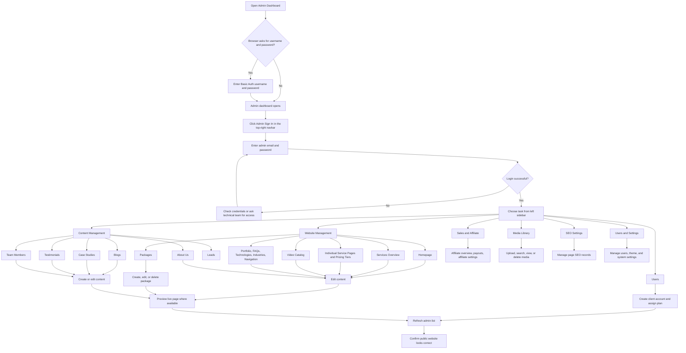

## Login Workflow

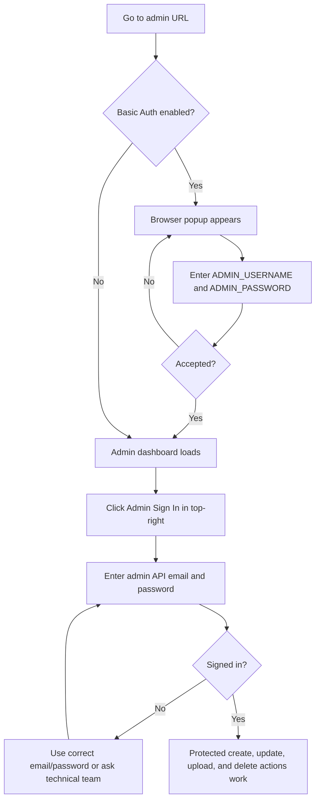

Important note: the app currently has two access layers.

1. Basic Auth protects the admin website itself when `ADMIN_USERNAME` and `ADMIN_PASSWORD` are configured.
2. The top-right `Admin Sign In` modal signs into the backend API and saves the admin's session in the browser. This is required for protected backend changes such as uploads, package edits, leads, blogs, case studies, and other CMS data. The session refreshes itself automatically in the background, so an admin generally does not need to sign in again during normal use — only if the session has been idle for a very long time, in which case any save will fail with an authorization error and the admin should sign in again from the top-right button.

## Package Editing Workflow

Packages are the pricing plans shown on the public `/packages` page (Starter, Professional, Enterprise, and similar tiers). Each package can optionally show a thumbnail image, and its "Everything Included" bullet points are fully editable from the form — nothing needs to be hardcoded by a developer.

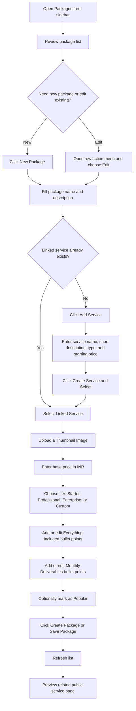

### Package Rules For Non-Technical Admins

- Every package must be connected to a service.
- Upload a `Thumbnail Image` for each package — this is the picture shown on the pricing card on the public website. If a package has no thumbnail, the site falls back to a generic illustration, so a real photo/image always looks better.
- `Everything Included` and `Monthly Deliverables` are plain bullet-point lists — type one item, press Enter (or click Add), and repeat. Remove a bullet with its delete icon. These points appear exactly as typed on the public pricing card.
- Use `Popular` for the plan that should be highlighted on the website.
- Use the delete icon only when the package should be removed permanently. The app asks for confirmation before deleting.
- If saving fails with an authorization message, sign in again using the top-right `Admin Sign In` button.

## New User Creation And Plan Assignment Workflow

Use this workflow when a new client should be created manually by the admin team instead of signing up from the public website.

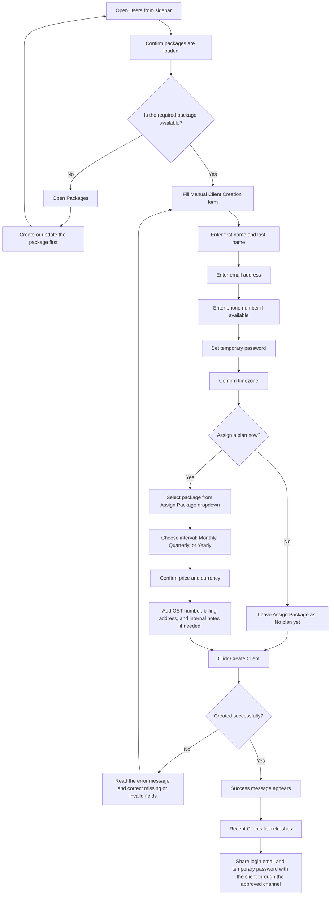

### User And Plan Rules For Non-Technical Admins

- Use `Users` to create client accounts manually.
- The client must have first name, last name, email, and temporary password.
- Phone is optional, but if entered, keep the country code and 10-digit phone number correct.
- `Assign Package` can be left as `No plan yet` if the client should be created without a subscription.
- When assigning a package, confirm the billing interval and price before clicking `Create Client`.
- The price auto-fills from the selected package, but it can be reviewed before saving.
- GST number, billing address, and internal notes are optional business details.
- After creation, send the client their email and temporary password only through the approved private communication channel.
- If packages do not load, sign in again using the top-right `Admin Sign In` button or ask the technical team to check API access.

### Step-By-Step: Create A New Client Manually

Use these steps when the admin team needs to create a client account from the admin dashboard.

1. Open the admin dashboard.
2. If the browser asks for Basic Auth, enter the admin website username and password.
3. Click `Admin Sign In` in the top-right navbar.
4. Enter the admin API email and password.
5. Open `Users` from the left sidebar.
6. Wait for the `Available Packages` count to load.
7. In the `Manual Client Creation` form, enter the client's `First Name`.
8. Enter the client's `Last Name`.
9. Enter the client's `Email`.
10. Enter the client's phone number only if available.
11. If phone is entered, keep the country code separate, for example `+91`.
12. Enter exactly 10 digits in the phone number field.
13. Enter a temporary password in `Temporary Password`.
14. Keep `Timezone` as `Asia/Kolkata` unless the client is in another timezone.
15. If the client should not get a plan immediately, leave `Assign Package` as `No plan yet`.
16. If the client should get a plan immediately, follow the package assignment steps below.
17. Add `GST Number` only if the client has provided a valid GSTIN.
18. Add `Billing Address` if available.
19. Add `Internal Notes` only for admin team reference.
20. Click `Create Client`.
21. Wait for the success message.
22. Confirm the client appears in the `Recent Clients` list.
23. Share the login email and temporary password with the client through the approved private channel.

### Step-By-Step: Assign A Package While Creating A Client

Use these steps inside the same `Manual Client Creation` form on the `Users` page.

1. Click the `Assign Package` dropdown.
2. Select the package the client has purchased or should receive.
3. Confirm that the selected package name is correct.
4. Choose the billing `Interval`: `Monthly`, `Quarterly`, or `Yearly`.
5. Check the `Price` field.
6. If the price is empty, confirm the package setup in `Packages` first.
7. Keep `Currency` as `INR` unless the business team has approved another currency.
8. Fill the remaining client details.
9. Click `Create Client`.
10. Check the success message. It should say the client was created and assigned the selected plan.
11. If an error appears, correct the highlighted field and click `Create Client` again.

Important: package assignment happens at the time you click `Create Client`. If you leave `Assign Package` as `No plan yet`, the user is created without an active subscription.

### Common Mistakes During Client Creation

| Problem | What to do |
| --- | --- |
| Packages are not loading | Click `Refresh`; if still empty, sign in again with `Admin Sign In`. |
| Client phone is rejected | Enter only 10 digits in the phone field and keep country code separate. |
| Name is rejected | Remove numbers or symbols from first name and last name. |
| Email is rejected | Check spelling and make sure the email has a valid format like `name@company.com`. |
| Price is missing after selecting package | Open `Packages`, check the package base price, then return to `Users`. |
| Create Client fails with authorization error | Sign in again from the top-right `Admin Sign In` button. |

## Individual Service Page Workflow

The sidebar contains service pages for SEO, Google Ads, Meta Ads, Website Design, Video Editing, Graphic Design, and E-Commerce.

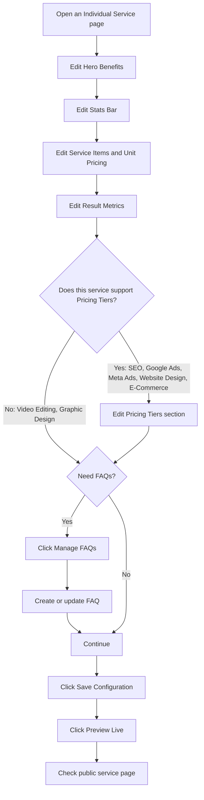

### Service Page Fields

- Hero Benefits: short bullet points shown near the top of the service page.
- Stats Bar: proof points such as project count, speed, savings, or growth metrics.
- Service Items and Unit Pricing: detailed offerings inside the service, such as logo design, ad setup, or SEO audit pricing.
- Result Metrics: measurable outcomes used for trust and case-study preview.
- Pricing Tiers: a dedicated pricing-plan section that only appears on the SEO, Google Ads, Meta Ads, Website Design, and E-Commerce pages. Each tier has its own name, price, billing period, and list of included bullet points (up to 4 tiers per page). This is separate from `Packages` — it lets a single service page show tiers specific to that service without needing a matching entry in the main `Packages` list.
- Packages: the general cross-service pricing plans shown on `/packages`, managed centrally in `Packages`.
- FAQs: managed centrally in `FAQs`, not inside the service page.

## Website Management Workflow

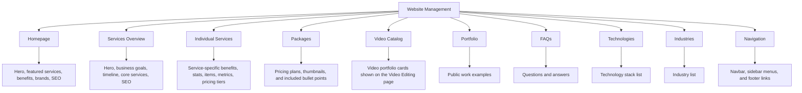

## Video Catalog Workflow

The Video Catalog controls the video showcase cards on the public `/video-editing` page — each card has a thumbnail, a video link, and a category, but no price (prices were removed from these cards; only a "Connect to Team" call-to-action is shown).

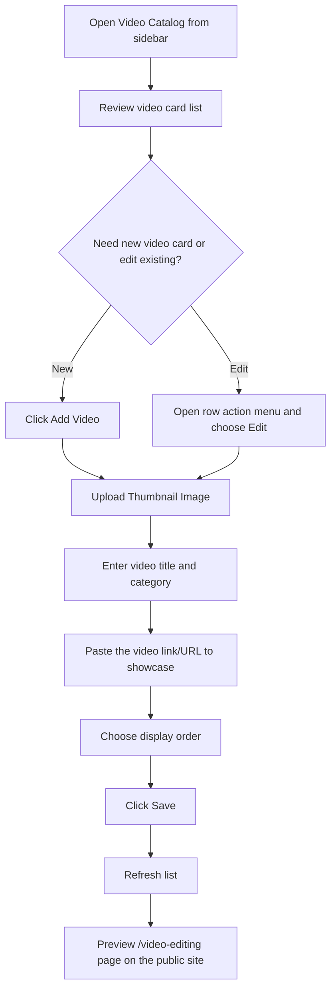

### Video Catalog Rules For Non-Technical Admins

- Always upload a real `Thumbnail Image` — cards fall back to a generic illustration if none is set, which looks unfinished on the public site.
- The video link should point to the actual video (e.g. a hosted or embeddable video URL) the card should open or play.
- Use display order to control which cards appear first.

## Content Management Workflow

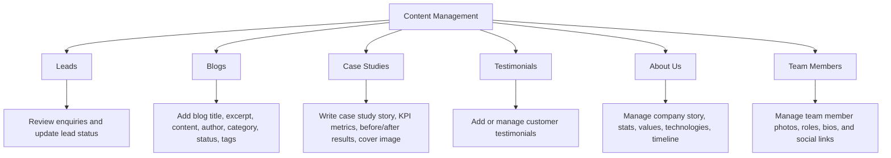

### Case Studies: What They Are And How To Edit Them

A case study is a success-story page (challenge, strategy, results) that proves the agency's work to potential clients. Opening `Case Studies` shows every case study, including unpublished drafts, so an admin can keep working on a story before it goes live.

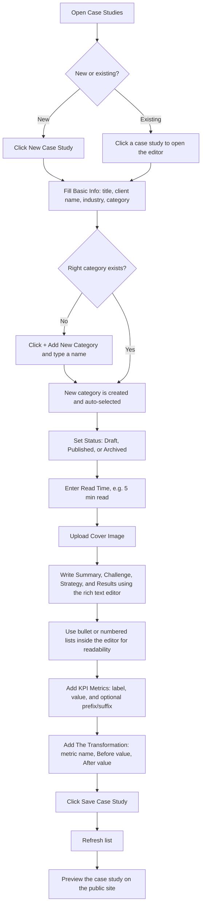

- **Basic Info**: title, client name, industry, and category. Categories can be created inline — click `+ Add New Category`, type a name, and it is created and selected immediately without leaving the page.
- **Status**: `Draft` (not visible to the public), `Published` (live on the website), or `Archived` (hidden but kept for records). Status can be changed at any time, not just when first creating the case study.
- **Read Time**: a short text shown on the case study card and detail page, for example `5 min read`.
- **Cover Image**: the hero image used on the case study card and detail page.
- **Story fields** (Summary, Challenge, Strategy/Solution, Results): each uses a rich text editor, so bullet points and numbered lists can be added directly instead of typing plain paragraphs — the public site renders these as real formatted lists.
- **KPI Metrics**: the highlight numbers shown near the top of a case study (for example "+400% Organic Traffic"). Each metric has a label, a value, and optional prefix/suffix symbols.
- **The Transformation**: the before/after comparison shown on the case study page (for example "Monthly Leads — Before: 12, After: 87"). Each row needs a metric name, a Before value, and an After value; a row only appears on the public site once all three are filled in and saved.

### Team Members: What They Are And How To Edit Them

Team Members has its own page in the sidebar (separate from `About Us`) and controls the team directory shown on the public `/about-us` page.

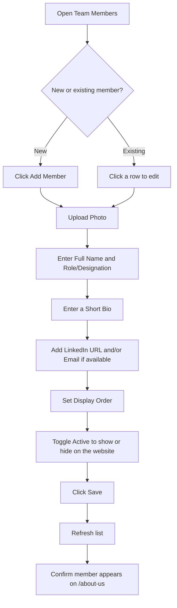

- The `About Us` page's Team section now simply links to `Team Members` — team profiles are no longer edited from inside `About Us`.
- A member must have a photo uploaded to look correct on the public team grid; the initial letter of their name is shown as a placeholder until a photo is added.
- Setting `Active` to off hides a member from the public site without deleting their record.

## Media Library Workflow

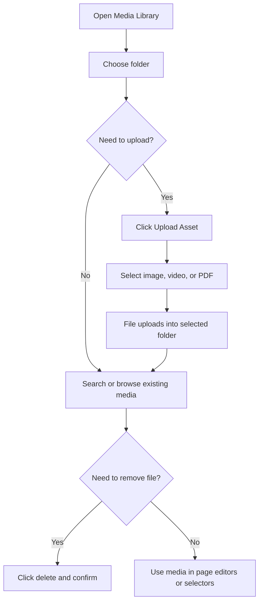

Folders currently available in the media library include `general`, `blogs`, `services`, `homepage`, `case-studies`, `packages`, `team`, and `video-catalog`. Most editors (Packages, Team Members, Video Catalog, Case Studies) automatically upload into their own matching folder; a few less-used upload spots (Industries, Technologies, Settings logo, Homepage gallery/hero, SEO images) currently save into the shared `general` folder.

## Common Admin Actions

| Action | Where to go | What to do |
| --- | --- | --- |
| Edit website homepage | `Homepage` | Open a section, edit text/media, preview live page. |
| Edit a service landing page | `Individual Services` | Choose service, edit benefits/stats/items/metrics/pricing tiers, save configuration, preview live. |
| Add a new pricing plan | `Packages` | Click `New Package`, select or create linked service, upload thumbnail, enter price/tier, edit bullet points, save. |
| Add a service-specific pricing tier | `Individual Services` (SEO, Google Ads, Meta Ads, Website Design, E-Commerce only) | Open the service page's Pricing Tiers section, add a tier with name/price/bullets, save configuration. |
| Add or edit a video showcase card | `Video Catalog` | Click `Add Video`, upload thumbnail, enter title/category/link, save. |
| Create a new client user | `Users` | Fill Manual Client Creation form, enter temporary password, optionally assign package, click `Create Client`. |
| Assign a plan to a new client | `Users` | Select a package in `Assign Package`, choose interval, confirm price/currency, then create client. |
| Add FAQ | `FAQs` | Click `Add FAQ`, enter question, answer, category, status, create. |
| Add blog | `Blogs` | Click `Add Blog`, enter article details, choose author/category/status, save. |
| Create or edit a case study | `Case Studies` | Fill basic info, pick or create a category, write the story with the rich text editor, add KPI metrics and The Transformation, save. |
| Add or edit a team member | `Team Members` | Click `Add Member`, upload photo, fill name/role/bio/links, save. |
| Upload website image | `Media Library` | Pick folder, click `Upload Asset`, select file. |
| Check customer enquiries | `Leads` | Review lead list and update/delete as needed. |
| Change menu links | `Navigation` | Edit top navbar, sidebar menus, marketing services menu, or footer links. |
| Change SEO | Page editor or `SEO Settings` | Update meta title, description, keywords, canonical URL, and OpenGraph image. |

## Safe Operating Checklist

1. Sign in through the top-right `Admin Sign In` button before making changes.
2. For content edits, change one section at a time.
3. Use `Preview Live` after saving whenever the page has a preview button.
4. Refresh the admin list after create, update, or delete actions.
5. Do not delete packages, media, blogs, FAQs, case studies, team members, or testimonials unless you are sure they are no longer needed.
6. Keep prices in INR where the package or pricing-tier manager asks for a price.
7. Before creating a client, confirm the email address and assigned package are correct.
8. Share temporary client passwords only through an approved private channel.
9. Use `Draft` for content that is not ready for public display and `Published` only when it can go live — this applies to blogs, testimonials, and case studies.
10. Always upload real thumbnail/cover images for packages, case studies, video catalog cards, and team members — several of these show a plain placeholder if left empty.
11. If an action fails with `401` or authorization error, sign out and sign in again from the top-right admin account menu.

## Feature Map

| Sidebar area | Feature | Current purpose |
| --- | --- | --- |
| Dashboard | Dashboard | Main landing screen for the CMS. |
| Website Management | Homepage | Manage landing page sections and homepage SEO. |
| Website Management | Services Overview | Manage the main services index page. |
| Website Management | Individual Services | Manage each service landing page content, pricing tiers (on 5 select pages), and connect to FAQs. |
| Website Management | Packages | Create, edit, delete, and highlight pricing packages, thumbnails, and included bullet points. |
| Website Management | Video Catalog | Manage the video showcase cards on the Video Editing page. |
| Website Management | Portfolio | Manage public work examples. |
| Website Management | FAQs | Create and delete frequently asked questions. |
| Website Management | Technology Stack | Manage technology list used on the website. |
| Website Management | Industries | Manage industries served. |
| Website Management | Navigation | Manage top navbar, sidebar menus, marketing services menu, and footer links. |
| Content Management | Leads | Review and manage customer enquiries. |
| Content Management | Blogs | Create/delete blogs and control draft/published status. |
| Content Management | Case Studies | Write case study stories with rich text lists, KPI metrics, before/after transformation stats, cover image, categories, and read time. |
| Content Management | Testimonials | Manage customer testimonials. |
| Content Management | About Us | Manage company story, statistics, values, technologies, and timeline sections (team is managed separately). |
| Content Management | Team Members | Manage team member photos, roles, bios, social links, and display order. |
| Sales & Affiliate | Affiliate Overview, Payouts, Affiliate Settings | Manage the affiliate/referral program and its payouts. |
| Global | Documents | Store and share files such as contracts, NDAs, proposals, and reports. |
| Global | Media Library | Upload, search, view, and delete public media assets across all folders. |
| Global | SEO Settings | Manage SEO records. |
| Global | Users | Create client accounts manually, assign plans, and review recent clients. |
| Global | Settings | Manage theme, logos, and system settings. |

## When To Ask The Technical Team

- The browser Basic Auth username/password is not accepted.
- The top-right Admin Sign In account is not accepted, even after retrying.
- A save action fails repeatedly after signing in again.
- A required blog author, FAQ category, service, or package is missing and cannot be created from the screen.
- A public page does not update after saving and refreshing.
- A media upload fails or an uploaded image/thumbnail does not appear on the website.
- Case study KPI Metrics or The Transformation rows do not appear on the public page after being saved in the editor.
