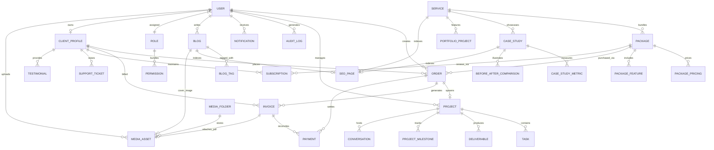

# The Simbolo — Phase 3: Database Design & Architecture

> [!IMPORTANT]
> **Phase 3 Status: Completed.**  
> This document defines the authoritative relational database architecture for **The Simbolo** (AI-powered Digital Marketing Platform). The database layer is built using **PostgreSQL** and **Prisma ORM**, adhering strictly to Third Normal Form (3NF), explicit foreign key modeling, UUID primary keys, and comprehensive indexing strategies.

---

## Table of Contents
1. [Executive Summary & 3NF Principles](#1-executive-summary--3nf-principles)
2. [Entity Relationship (ER) Diagram](#2-entity-relationship-er-diagram)
3. [Naming Conventions & Enum Strategy](#3-naming-conventions--enum-strategy)
4. [Core Entity Modules & Relationships](#4-core-entity-modules--relationships)
5. [Indexing & Query Optimization Strategy](#5-indexing--query-optimization-strategy)
6. [Cascade & Referential Integrity Strategy](#6-cascade--referential-integrity-strategy)
7. [Soft-Delete Strategy & Audit Fields](#7-soft-delete-strategy--audit-fields)
8. [Future Expansion Considerations](#8-future-expansion-considerations)

---

## 1. Executive Summary & 3NF Principles

The Simbolo database architecture is engineered to power three distinct applications across a unified monorepo:
* **Landing Website**: High-speed read queries for SEO pages, services catalogs, packages, case studies, portfolios, and blogs.
* **Client Dashboard**: Multi-tenant customer portal managing corporate profiles, commercial orders, active project Kanban boards, invoices, subscriptions, and affiliate referral metrics.
* **Admin CMS**: Granular operational control for staff, role-based access control (RBAC), content management, financial ledger audits, and system diagnostics.

### Core Database Design Principles:
* **Third Normal Form (3NF)**: Every non-key attribute is non-transitively dependent strictly on the primary key. Duplicated data is eradicated; descriptive data (e.g., package pricing or SEO titles) is stored once in dedicated entities (`PackagePricing`, `SEOPage`) and referenced via foreign keys.
* **Universal UUIDs**: All primary keys utilize UUIDv4 (`@id @default(uuid()) @db.Uuid`). UUIDs prevent ID enumeration vulnerabilities, simplify distributed data merging across database replicas, and decouple client IDs from sequential auto-increment counters.
* **Explicit Relationships**: Every foreign key is explicitly typed and named, preventing ORM ambiguity and ensuring predictable JOIN generation in SQL DDL.

---

## 2. Entity Relationship (ER) Diagram

The high-level Mermaid ER diagram below illustrates the core data relationships across identity, commercial orders, project workflows, and content management.



---

## 3. Naming Conventions & Enum Strategy

### Naming Standards:
* **Table Names (`@@map`)**: All physical database tables are explicitly mapped to **plural snake_case** identifiers (e.g., `client_profiles`, `package_pricings`, `audit_logs`, `before_after_comparisons`). This aligns with PostgreSQL standards and prevents case-sensitivity issues during raw SQL migrations.
* **Model & Field Names**: Prisma schema models and TypeScript properties follow clean **PascalCase** for model definitions and **camelCase** for field attributes.
* **Foreign Keys**: Explicitly formatted as `<targetEntity>Id` (e.g., `clientId`, `packageId`, `uploaderId`).
* **Junction Tables**: Many-to-many relationships utilize descriptive junction entities (e.g., `TeamMember`) or explicit Prisma implicit relation names (`@relation("BlogToTag")`).

### Preventing Enum-Model Collisions:
In GraphQL and ORM schema designs, enums and models cannot share identical namespaces. To ensure clarity and eliminate naming collisions, every PostgreSQL enum type is suffixed with `Enum`:
* `UserRoleEnum` (prevents collision with a `Role` model)
* `ProjectStatusEnum` (prevents collision with the `ProjectStatus` history log model)
* `FAQStatusEnum` (prevents collision with the `FAQ` model)
* `TestimonialStatusEnum`

---

## 4. Core Entity Modules & Relationships

### 4.1. Identity, Auth & RBAC Module
* **`User`**: Root identity model. Links 1-to-1 with `ClientProfile`, `Affiliate`, and `BlogAuthor`. Holds foreign keys to `Role`, `Organization`, and `Agency`.
* **`Role` & `Permission`**: Modeled as an explicit Many-to-Many relationship (`RolePermissions`). Allows dynamic role creation without altering schema structure.
* **`RefreshToken` & `Session`**: Linked directly to `User` with `onDelete: Cascade`. Captures IP addresses and User-Agent fingerprints for security anomaly detection.

### 4.2. Commercial Catalog & Pricing Module
* **`Service`**: Master catalog entity. Belongs to `ServiceCategory` and holds a polymorphic 1-to-1 relation with `SEOPage`.
* **`Package`**: Bundled commercial tier under a `Service`.
* **`PackagePricing` & `PackageFeature`**: Fully normalized child entities. `PackagePricing` supports multi-currency schedules (`INR`, `USD`, `EUR`) and billing intervals (`monthly`, `annually`) under a unique composite index: `@@unique([packageId, currency, billingPeriod])`.

### 4.3. Order Processing, Payments & Billing Module
* **`Order`**: Commercial agreement linking a `ClientProfile` to a `Service` and `Package`. Acts as the parent state machine for fulfillment.
* **`Project`**: Spawned 1-to-1 upon order confirmation (`orderId String @unique`).
* **`Invoice`**: Tax-compliant billing document containing GST deductions and subtotal breakdowns. Can be generated from an `Order` or a recurring `Subscription`.
* **`Payment` & `Transaction`**: Captures gateway webhooks (Stripe, Razorpay). A single `Payment` attempt can log multiple immutable `Transaction` events (e.g., auth, capture, refund).

### 4.4. Project Kanban & Client Workflow Module
* **`Project`**: Operates under a dedicated manager (`managerId` -> `User`).
* **`ProjectMilestone` & `ProjectStatus`**: Tracks scheduled SLA dates and historical status transitions over time.
* **`Task`**: Granular internal Kanban item assigned to staff members.
* **`Deliverable`**: Client-facing review gate. References `MediaAsset` for Figma designs, video reels, or reports.

### 4.5. Content Management (CMS) & SEO Module
* **`Blog`**, **`CaseStudy`**, **`PortfolioProject`**, and **`FAQ`**: Core marketing entities.
* **`SEOPage`**: Reusable 1-to-1 metadata repository holding meta titles, OG cards, canonical URLs, and schema.org JSON-LD scripts.
* **`CaseStudyMetric` & `BeforeAfterComparison`**: Normalizes quantitative proof points (`+240% Traffic`) and interactive before/after image sliders.

### 4.6. Centralized Media Pipeline Module
* **`MediaAsset`**: Universal file registry. Instead of duplicating S3 keys across different content models, `MediaAsset` acts as a central repository referenced polymorphically by `Deliverable`, `Blog`, `CaseStudy`, `PortfolioProject`, and `Invoice`.
* **`MediaFolder`**: Supports hierarchical self-referential tree nesting (`parentId`) for clean CMS media organization.

---

## 5. Indexing & Query Optimization Strategy

To guarantee sub-10ms query execution across millions of records, B-Tree indexes (`@@index`) are strategically applied across high-frequency access patterns:
1. **Primary & Foreign Keys**: All UUID primary keys and relational foreign keys (`clientId`, `orderId`, `serviceId`) are indexed to optimize relational `JOIN` operations.
2. **URL Slugs & Lookups**: Unique indexes (`@@unique`) on `slug`, `email`, `orderNumber`, `invoiceNumber`, and `affiliateCode` enforce data integrity and power O(1) B-Tree lookups during frontend routing.
3. **Filtering & Status Columns**: Enums used in dashboard filtering (`status`, `type`, `priority`, `isRead`) are indexed to prevent full-table scans when querying active orders, open support tickets, or unread notifications.
4. **Time-Series Ordering**: Timestamp columns (`createdAt`, `timestamp`, `publishDate`) are indexed on analytics entities (`PageView`, `EventLog`, `AuditLog`) to speed up chronological pagination and date-range reporting.
5. **Composite Unique Indexes**: Applied where domain logic dictates uniqueness across multi-column pairs:
   * `@@unique([packageId, currency, billingPeriod])` on `PackagePricing`
   * `@@unique([conversationId, userId])` on `Participant`
   * `@@unique([teamId, userId])` on `TeamMember`

---

## 6. Cascade & Referential Integrity Strategy

Referential integrity rules are strictly governed by **ownership semantics**:
* **`onDelete: Cascade` (Strict Child Ownership)**: When a parent entity owns its children exclusively and the child has no independent business meaning, deletion of the parent automatically removes the children.
  * Deleting a `User` -> Cascades to `RefreshToken`, `Session`, `Notification`, and `NotificationPreference`.
  * Deleting a `Package` -> Cascades to `PackageFeature`, `PackagePricing`, and `PackageComparison`.
  * Deleting a `Project` -> Cascades to `ProjectMilestone`, `Task`, `Deliverable`, `Timeline`, and `Conversation`.
  * Deleting an `Order` -> Cascades to `OrderItem` and `Commission`.
* **`onDelete: Restrict / Set Null` (Preserved Business & Audit Records)**: When an entity represents financial, legal, or shared historical data, cascading deletions are prohibited.
  * Deleting a `User` (Staff/Client) does **NOT** cascade delete their `Orders`, `Invoices`, `Payments`, or `AuditLogs`. Instead, historical records remain intact for accounting and statutory auditing.
  * Deleting a `MediaAsset` is restricted if currently referenced by an active `Invoice` or `Deliverable`.

---

## 7. Soft-Delete Strategy & Audit Fields

### Soft-Delete Implementation:
To prevent accidental data loss of valuable commercial and marketing content, hard deletions (`DELETE FROM ...`) are replaced with declarative soft-deletes via the nullable timestamp:
```prisma
deletedAt DateTime?
```
Soft-deletes are implemented on:
* **Core Identity**: `User`, `Organization`, `Agency`
* **Commercial Profiles**: `ClientProfile`, `Company`
* **Marketing Catalog**: `Service`, `Package`, `Blog`, `CaseStudy`, `PortfolioProject`, `Testimonial`, `FAQ`
* **Operational Workspaces**: `Order`, `Project`, `Deliverable`, `Subscription`, `Invoice`, `MediaAsset`

In Phase 4 (NestJS implementation), Prisma middleware / extensions will automatically intercept `.findMany()` and `.findFirst()` queries, injecting `WHERE deletedAt IS NULL` to hide archived records cleanly without data destruction.

### Audit Accountability Fields:
Every major business entity includes standardized accountability stamps:
```prisma
createdAt DateTime @default(now())
updatedAt DateTime @updatedAt
createdBy String?
updatedBy String?
```
* `createdAt` and `updatedAt` are managed automatically by Prisma ORM.
* `createdBy` and `updatedBy` store the UUID string of the acting user (injected via NestJS request interceptors during Phase 4), ensuring complete traceability across data modifications.

---

## 8. Future Expansion Considerations

The database architecture pre-allocates expansion vectors to accommodate third-party SaaS integrations without requiring structural breaking schema changes:
1. **Payment Gateways**: `Payment` and `Subscription` models reserve dedicated fields (`gatewayProvider`, `gatewayTransactionId`, `gatewayOrderId`, `stripeSubscriptionId`, `razorpaySubscriptionId`) to switch effortlessly between Indian UPI/Card routing (Razorpay) and global multi-currency billing (Stripe).
2. **External Calendar Providers**: The `CalendarEvent` model decouples consultation meetings from third-party APIs (`provider`, `externalEventId`), supporting simultaneous Google Calendar and Microsoft Outlook two-way syncing.
3. **White-Label Agency Scaling**: The `Agency` model supports custom DNS mappings (`whiteLabelDomain`) and multi-tier sub-client hierarchies (`subClients ClientProfile[] @relation("AgencySubClients")`) to support enterprise reseller networks.
4. **Full-Text Search & AI Embeddings**: Text columns (`title`, `description`, `content`, `question`, `answer`) are structured to map directly into PostgreSQL `tsvector` GIN indexes or sync asynchronously to Meilisearch / Elasticsearch vector engines.
5. **Telemetry & ClickHouse Export**: The high-volume telemetry tables (`PageView`, `EventLog`) are structured cleanly without foreign key constraints on target event metadata, allowing effortless batch-offloading to ClickHouse or Apache Druid as platform analytics traffic scales.

---

## Conclusion & Next Steps (Phase 4 Transition)
With Phase 3 complete, **The Simbolo** possesses a fully validated, normalized, and migration-ready relational database foundation. 

**Next Phase Transition**: In **Phase 4: Backend Implementation**, we will initialize the NestJS application structure, implement Prisma repositories and connection pooling, build out modular domain controllers/services, configure JWT authentication guards, and bind REST API endpoints directly to this schema!
